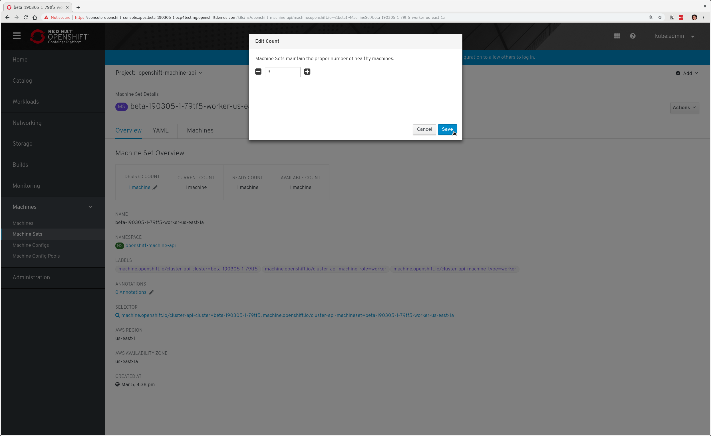
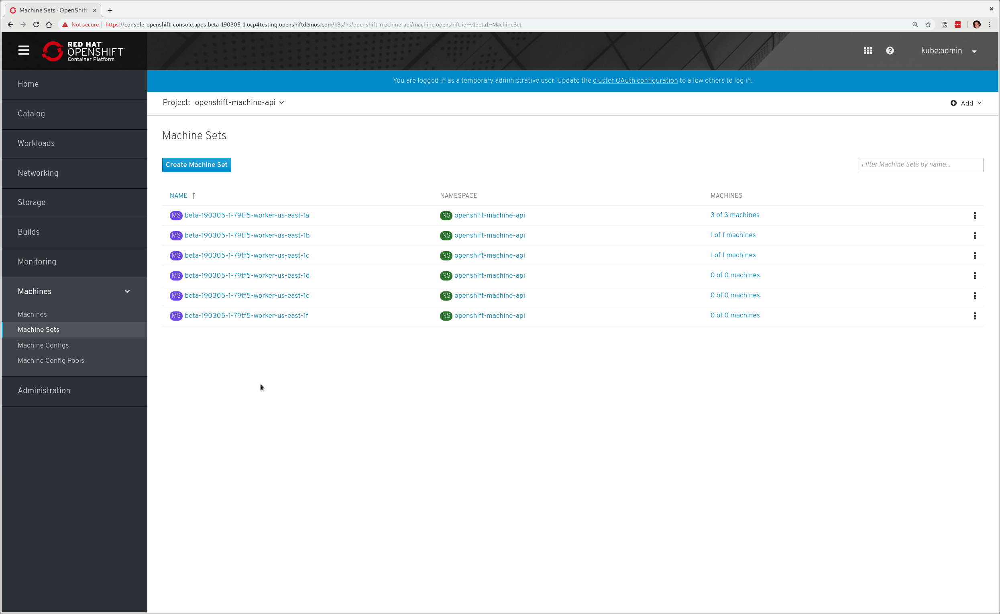
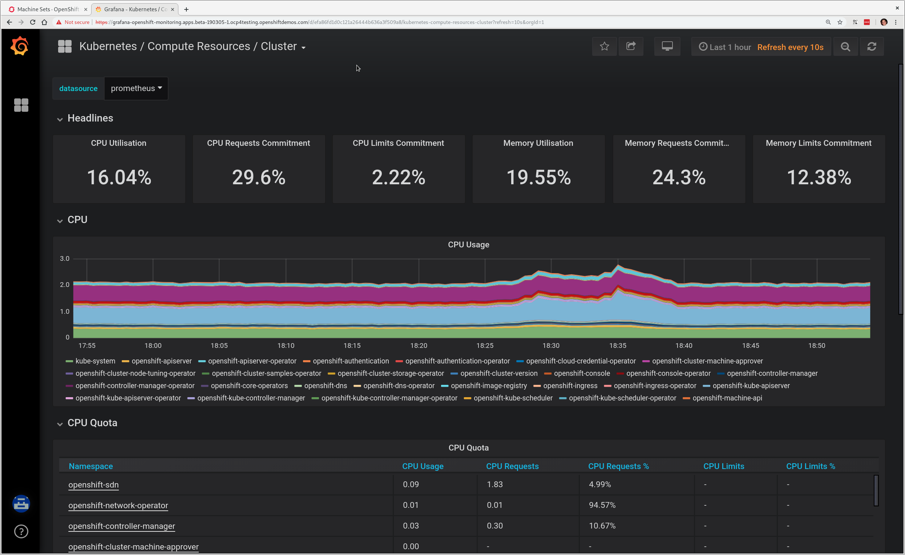

# Scaling an OpenShift 4 Cluster 
With OpenShift 4.0+, we now have the ability to dynamically scale the cluster
size through OpenShift itself.

## Manual Cluster Scale Up/Down

In this exercise we're going to manually add worker nodes to our cluster:

1. Go to the OpenShift web console and login with `kubeadmin` (or your admin
username if different)
1. Browse to `Machines` on the left-hand side-bar, and click `Machine Sets`.
1. On the `Machine Sets` page, select `openshift-machine-api` from the `Project`
dropdown and you should see the machine sets:

     <center></center>

1. Select one of the machine sets in the list by clicking on the name, e.g.
"**beta-190305-1-79tf5-worker-us-east-1a**" (yours will be slightly different)

   Depending on the AWS region you chose, you may have several worker machine
   sets that can be scaled, some of which are at a scale of 0. It does not
   matter which set you choose for this example.
1. In the `Actions` pull down menu (on the right hand side), select `Edit Count`

1. Enter '3' and click `Save`

  <center></center>

At this point you can click the `Machines` tab in this `Machine Set` display
and see the allocated machines. The `Overview` tab will let you know when the
machines become ready. If you click `Machine Sets` under `Machines` on the
left-hand side again, you will also see the status of the machines in the set:

  <center></center>

It will take several minutes for the new machines to become ready. In the
background additional EC2 instances are being provisioned and then registered
and configured to participate in the cluster, so yours may still show 1/3.

You can also view this in the CLI:

~~~bash
$ oc get machinesets -n openshift-machine-api
NAME                                    DESIRED   CURRENT   READY     AVAILABLE   AGE
beta-190305-1-79tf5-worker-us-east-1a   3         3         3         3           23h
beta-190305-1-79tf5-worker-us-east-1b   1         1         1         1           23h
beta-190305-1-79tf5-worker-us-east-1c   1         1         1         1           23h
beta-190305-1-79tf5-worker-us-east-1d   0         0                               23h
beta-190305-1-79tf5-worker-us-east-1e   0         0                               23h
beta-190305-1-79tf5-worker-us-east-1f   0         0                               23h

$ oc get nodes
NAME                           STATUS    ROLES     AGE       VERSION
ip-10-0-132-138.ec2.internal   Ready     worker    2m6s      v1.12.4+5dc94f3fda
ip-10-0-137-104.ec2.internal   Ready     worker    23h       v1.12.4+5dc94f3fda
ip-10-0-140-138.ec2.internal   Ready     master    24h       v1.12.4+5dc94f3fda
ip-10-0-140-67.ec2.internal    Ready     worker    2m6s      v1.12.4+5dc94f3fda
ip-10-0-158-222.ec2.internal   Ready     master    24h       v1.12.4+5dc94f3fda
ip-10-0-159-179.ec2.internal   Ready     worker    23h       v1.12.4+5dc94f3fda
ip-10-0-168-43.ec2.internal    Ready     master    24h       v1.12.4+5dc94f3fda
ip-10-0-171-135.ec2.internal   Ready     worker    23h       v1.12.4+5dc94f3fda
~~~

You'll note that some of these systems 'age' will be much newer than some of the
others, these are the ones that will have just been added in. Before continuing,
scale back down by editing the count to whatever it was previously for the
`Machine Set`, i.e. return it to '1' node.

### Note
The default installation currently creates two routers, but they are on the
same host. This is a known bug. It is possible that when you scale down your
cluster that you may inadvertently end up removing the node where the router
was running, which will temporarily make the console and other resources
unavailable. If you suddenly lose access to the web console, wait a few
moments, and then check to see the status of the router pod with:

~~~bash
$ oc get pod -n openshift-ingress
NAME                            READY     STATUS    RESTARTS   AGE
router-default-dffd8548-6g4hz   1/1       Running   0          23h
router-default-dffd8548-vxtt8   1/1       Running   0          23h
~~~

If there is no router pod, or if it is in the `ContainerCreating` state, wait
a little longer.

## Modifying via the CLI

You can alter the `Machine Set` count in several ways in the web UI console,
but you can also perform the same operation via the CLI by using the `oc edit`
command on the `machineset` in the `openshift-machine-api` project-

~~~bash
$ oc edit machineset -n openshift-machine-api
(opens in vi)
~~~

You will see the following text:

~~~bash
# Please edit the object below. Lines beginning with a '#' will be ignored,
# and an empty file will abort the edit. If an error occurs while saving this file will be
# reopened with the relevant failures.
apiVersion: v1
items:
- apiVersion: machine.openshift.io/v1beta1
  kind: MachineSet
  metadata:
    creationTimestamp: 2019-03-05T16:38:39Z
    generation: 3
    labels:
      machine.openshift.io/cluster-api-cluster: beta-190305-1-79tf5
      machine.openshift.io/cluster-api-machine-role: worker
      machine.openshift.io/cluster-api-machine-type: worker
    name: beta-190305-1-79tf5-worker-us-east-1a
    namespace: openshift-machine-api
    resourceVersion: "909452"
    selfLink: /apis/machine.openshift.io/v1beta1/namespaces/openshift-machine-api/machinesets/beta-190305-1-79tf5-worker-us-east-1a
    uid: 21236e24-3f65-11e9-b848-12efc11fb292
  spec:
    replicas: 1                                                                <---------------
    selector:
      matchLabels:
        machine.openshift.io/cluster-api-cluster: beta-190305-1-79tf5
        machine.openshift.io/cluster-api-machineset: beta-190305-1-79tf5-worker-us-east-1a
    template:
(...)
~~~

> **NOTE**: If you're uncomfortable with vi(m) you can use your favourite editor
by specifying `EDITOR=<your choice>` before the `oc` command.

The above is just an excerpt of the entire machine set configuration - each
machine set is listed in this file, but you'll need to change just one of the
sets. In the above output you'll see an line with an arrow to signify where you
can update the count - you'll need to change the `replica: 1` to the count of
your choice. For this example I'd recommend that you set it to '2'. To save your
changes simply save and quit from your editor. OpenShift will now **patch** the
configuration. You should see that your modified machine set (depending on which
one you edited) will be confirmed:

~~~bash
machineset.machine.openshift.io/beta-190305-1-79tf5-worker-us-east-1a edited
machineset.machine.openshift.io/beta-190305-1-79tf5-worker-us-east-1b skipped
machineset.machine.openshift.io/beta-190305-1-79tf5-worker-us-east-1c skipped
machineset.machine.openshift.io/beta-190305-1-79tf5-worker-us-east-1d skipped
machineset.machine.openshift.io/beta-190305-1-79tf5-worker-us-east-1e skipped
machineset.machine.openshift.io/beta-190305-1-79tf5-worker-us-east-1f skipped
~~~

Once that has been changed, you can view the outcome here:

~~~bash
$ oc get machinesets -n openshift-machine-api
NAME                                    DESIRED   CURRENT   READY     AVAILABLE   AGE
beta-190305-1-79tf5-worker-us-east-1a   2         2         2         2           23h
beta-190305-1-79tf5-worker-us-east-1b   1         1         1         1           23h
beta-190305-1-79tf5-worker-us-east-1c   1         1         1         1           23h
beta-190305-1-79tf5-worker-us-east-1d   0         0                               23h
beta-190305-1-79tf5-worker-us-east-1e   0         0                               23h
beta-190305-1-79tf5-worker-us-east-1f   0         0                               23h
~~~

Again, before you move forward, return this count back to how it was before,
using the same method as above.

## Automatic Cluster Scale Up

OpenShift can automatically scale the infrastructure based on workload provided
there is a configuration specified to do so.  Before we begin, ensure that your
cluster is back to having three nodes running:

~~~bash
$ oc get machinesets -n openshift-machine-api
NAME                                    DESIRED   CURRENT   READY     AVAILABLE   AGE
beta-190305-1-79tf5-worker-us-east-1a   1         1         1         1           24h
beta-190305-1-79tf5-worker-us-east-1b   1         1         1         1           24h
beta-190305-1-79tf5-worker-us-east-1c   1         1         1         1           24h
beta-190305-1-79tf5-worker-us-east-1d   0         0                               24h
beta-190305-1-79tf5-worker-us-east-1e   0         0                               24h
beta-190305-1-79tf5-worker-us-east-1f   0         0                               24h
~~~

### Define a `MachineAutoScaler`

Next, configure a `MachineAutoScaler` - you'll need to fetch the following YAML
file:

~~~bash
$ wget https://raw.githubusercontent.com/openshift/training/master/assets/machine-autoscale-example.yaml
~~~

The file has the following contents:

```YAML
kind: List
metadata: {}
apiVersion: v1
items:
- apiVersion: "autoscaling.openshift.io/v1alpha1"
  kind: "MachineAutoscaler"
  metadata:
    generateName: autoscale-<aws-region-az>-
    namespace: "openshift-machine-api"
  spec:
    minReplicas: 1
    maxReplicas: 4
    scaleTargetRef:
      apiVersion: machine.openshift.io/v1beta1
      kind: MachineSet
      name: <clusterid>-worker-<aws-region-az>
- apiVersion: "autoscaling.openshift.io/v1alpha1"
  kind: "MachineAutoscaler"
  metadata:
    generateName: autoscale-<aws-region-az>-
    namespace: "openshift-machine-api"
  spec:
    minReplicas: 1
    maxReplicas: 4
    scaleTargetRef:
      apiVersion: machine.openshift.io/v1beta1
      kind: MachineSet
      name: <clusterid>-worker-<aws-region-az>
- apiVersion: "autoscaling.openshift.io/v1alpha1"
  kind: "MachineAutoscaler"
  metadata:
    generateName: autoscale-<aws-region-az>-
    namespace: "openshift-machine-api"
  spec:
    minReplicas: 1
    maxReplicas: 4
    scaleTargetRef:
      apiVersion: machine.openshift.io/v1beta1
      kind: MachineSet
      name: <clusterid>-worker-<aws-region-az>
```

When you looked at the `MachineSets` with the CLI, you noticed that they all
had the format of:

    <clusterid>-worker-<aws-region-az>

`MachineAutoscaler` resources must be defined for each region-AZ that you want
to autoscale. Using the example output and `MachineSets` above, and selecting
"**us-east-1a**" as the region we're going to autoscale into, you would need
to modify the YAML file to look like the following:

```YAML
...
apiVersion: "autoscaling.openshift.io/v1alpha1"
kind: "MachineAutoscaler"
metadata:
  generateName: autoscale-us-east-1a-
  namespace: "openshift-machine-api"
spec:
  minReplicas: 1
  maxReplicas: 4
  scaleTargetRef:
    apiVersion: machine.openshift.io/v1beta1
    kind: MachineSet
    name: beta-190305-1-79tf5-worker-us-east-1a
...
```

To ensure you make no mistakes:

~~~bash
$ export CLUSTER_NAME=$(oc get machinesets -n openshift-machine-api | awk -F'-worker-' 'NR>1{print $1;exit;}')
$ export REGION_NAME=us-east-1a

$ sed -i s/\<aws-region-az\>/$REGION_NAME/g machine-autoscale-example.yaml
$ sed -i s/\<clusterid\>/$CLUSTER_NAME/g machine-autoscale-example.yaml
~~~

> **NOTE**: If you aren't deployed into this region, or don't want to use
us-east-1a, adapt the instructions to suit.

**Make sure** that you properly modify both `generateName` and `name`. Note
which one has the `<clusterid>` and which one does not. Note that
`generateName` has a trailing hyphen. You can specify the minimum and maximum
quantity of nodes that are allowed to be created by adjusting the
`minReplicas` and `maxReplicas`.

You do not have to define a `MachineAutoScaler` for each `MachineSet`. But
remember that each `MachineSet` corresponds to an AWS region/AZ. So, without
having multiple `MachineAutoScalers`, you could end up with a cluster fully
scaled out in a single AZ. If that's what you're after, it's fine. However if
AWS has a problem in that AZ, you run the risk of losing a large portion of
your cluster.

> **NOTE**: You should probably choose a small-ish number for `maxReplicas`. The
next lab will autoscale the cluster up to that maximum. You're paying for the
EC2 instances.**

Once the file has been modified appropriately, you can now create the
autoscaler:

~~~bash
$ oc create -f machine-autoscale-example.yaml -n openshift-machine-api
machineautoscaler.autoscaling.openshift.io/autoscale-us-east-1a-t6m9k created
machineautoscaler.autoscaling.openshift.io/autoscale-us-east-1a-vr59k created
machineautoscaler.autoscaling.openshift.io/autoscale-us-east-1a-zkt5t created
~~~

### Define a `ClusterAutoscaler`

Next we need to define a `ClusterAutoscaler`, this configures some boundaries
and behaviors for how the cluster will autoscale. An example definition file
can be found at:

https://raw.githubusercontent.com/openshift/training/master/assets/cluster-autoscaler.yaml

This definition is set for a maximum of 10 workers, but you can
change that limit if you desire. Remember, **you are paying for the EC2
instances**. If you don't wish to make any changes, you can simply `create` the
`ClusterAutoscaler` with the following command:

~~~bash
$ oc create -f https://raw.githubusercontent.com/openshift/training/master/assets/cluster-autoscaler.yaml
clusterautoscaler.autoscaling.openshift.io/default created
~~~

> **NOTE:** The `ClusterAutoscaler` is not a namespaced resource -- it exists at
the cluster scope.

### Define a `Job`

The following example YAML file defines a `Job`:

https://raw.githubusercontent.com/openshift/training/master/assets/job-work-queue.yaml

It will produce a massive load that the cluster cannot handle, and will force
the autoscaler to take action (up to the `maxReplicas` defined in your
ClusterAutoscaler YAML).

> **NOTE**: If you did not scale down your machines earlier, you may have too
much capacity to trigger an autoscaling event. Make sure you have no more than
3 total workers before continuing.

Create a project to hold the resources for the `Job`, and switch into it:

~~~bash
$ oc adm new-project autoscale-example && oc project autoscale-example
Created project autoscale-example
Now using project "autoscale-example" on server "https://api.beta-190305-1.ocp4testing.openshiftdemos.com:6443".
~~~

### Open Grafana
In the OpenShift web console, click `Monitoring` and then click `Dashboards`.
This will open a new browser tab for Grafana. You will also get a certificate
error similar to the first time you logged in. This is because Grafana has
its own SSL certificate. You will then see a login button. Grafana is
configured to use an OpenShift user and inherits permissions of that user for
accessing cluster information. This happens to be the user you're already
logged into the web console with.

Finally, allow the permissions, and then you will see the Grafana homepage.

Click the dropdown on `Home` and choose `Kubernetes / Compute Resources /
Cluster`. Leave this browser window open while you start the `Job` so that
you can observe the CPU utilization of the cluster rise:

  <center></center>

### Force an Autoscaling Event

Now we're ready to create the `Job`:

~~~bash
$ oc create -n autoscale-example -f https://raw.githubusercontent.com/openshift/training/master/assets/job-work-queue.yaml
job.batch/work-queue-qncs2 created
~~~

You will see a note that the `Job` was created. It will create a *lot* of `Pods`:

~~~bash
 $ oc get pod -n autoscale-example
NAME                     READY     STATUS    RESTARTS   AGE
work-queue-qncs2-26x9c   0/1       Pending   0          33s
work-queue-qncs2-28h6r   0/1       Pending   0          33s
work-queue-qncs2-2tdz9   0/1       Pending   0          33s
work-queue-qncs2-526hl   0/1       Pending   0          33s
work-queue-qncs2-55nr7   0/1       Pending   0          33s
work-queue-qncs2-5d98k   0/1       Pending   0          33s
work-queue-qncs2-7pd5p   0/1       Pending   0          31s
work-queue-qncs2-8k76z   0/1       Pending   0          32s
(...)
~~~

After a few moments, look at the list of `Machines`:

~~~bash
$ oc get machines -n openshift-machine-api
NAME                                          INSTANCE              STATE     TYPE        REGION      ZONE         AGE
beta-190305-1-79tf5-master-0                  i-080dea906d9750737   running   m4.xlarge   us-east-1   us-east-1a   26h
beta-190305-1-79tf5-master-1                  i-0bf5ad242be0e2ea1   running   m4.xlarge   us-east-1   us-east-1b   26h
beta-190305-1-79tf5-master-2                  i-00f13148743c13144   running   m4.xlarge   us-east-1   us-east-1c   26h
beta-190305-1-79tf5-worker-us-east-1a-8dvwq   i-06ea8662cf76c7591   running   m4.large    us-east-1   us-east-1a   2m7s  <--------
beta-190305-1-79tf5-worker-us-east-1a-9pzvg   i-0bf01b89256e7f39f   running   m4.large    us-east-1   us-east-1a   2m7s  <--------
beta-190305-1-79tf5-worker-us-east-1a-vvddp   i-0e649089d42751521   running   m4.large    us-east-1   us-east-1a   2m7s  <--------
beta-190305-1-79tf5-worker-us-east-1a-xx282   i-07b2111dff3c7bbdb   running   m4.large    us-east-1   us-east-1a   26h
beta-190305-1-79tf5-worker-us-east-1b-hjv9c   i-0562517168aadffe7   running   m4.large    us-east-1   us-east-1b   26h
beta-190305-1-79tf5-worker-us-east-1c-cdhth   i-09fbcd1c536f2a218   running   m4.large    us-east-1   us-east-1c   26h
~~~

You should see a scaled-up cluster with three new additions as worker nodes in
us-east-1a, you can see the ones that have been auto-scaled from their age.

Depending on when you run the command, your list may show all running
workers, or some pending. After the `Job` completes, which could take anywhere
from a few minutes to ten or more (depending on your `ClusterAutoscaler` size
and your `MachineAutoScaler` sizes), the cluster should scale down to the
original count of worker nodes. You can watch the output with the following
(runs every 10s)-

~~~bash
$ watch -n10 'oc get machines -n openshift-machine-api'
Every 10.0s: oc get machines -n openshift-machine-api

NAME                                          INSTANCE              STATE     TYPE        REGION      ZONE         AGE
beta-190305-1-79tf5-master-0                  i-080dea906d9750737   running   m4.xlarge   us-east-1   us-east-1a   26h
beta-190305-1-79tf5-master-1                  i-0bf5ad242be0e2ea1   running   m4.xlarge   us-east-1   us-east-1b   26h
beta-190305-1-79tf5-master-2                  i-00f13148743c13144   running   m4.xlarge   us-east-1   us-east-1c   26h
beta-190305-1-79tf5-worker-us-east-1a-8dvwq   i-06ea8662cf76c7591   running   m4.large    us-east-1   us-east-1a   10m
beta-190305-1-79tf5-worker-us-east-1a-9pzvg   i-0bf01b89256e7f39f   running   m4.large    us-east-1   us-east-1a   10m
beta-190305-1-79tf5-worker-us-east-1a-vvddp   i-0e649089d42751521   running   m4.large    us-east-1   us-east-1a   10m
beta-190305-1-79tf5-worker-us-east-1a-xx282   i-07b2111dff3c7bbdb   running   m4.large    us-east-1   us-east-1a   26h
beta-190305-1-79tf5-worker-us-east-1b-hjv9c   i-0562517168aadffe7   running   m4.large    us-east-1   us-east-1b   26h
beta-190305-1-79tf5-worker-us-east-1c-cdhth   i-09fbcd1c536f2a218   running   m4.large    us-east-1   us-east-1c   26h

(Ctrl-C to end)
~~~

In Grafana, be sure to click the `autoscale-example` project in the graphs,
otherwise the interesting things happening might get drowned out by the rest
of the baseline.

# Infrastructure Nodes
Continue on to the section that details [infrastructure nodes](05-infrastructure-nodes.md).
