# Extensions to OpenShift using OperatorHub

OpenShift 4 has a slimmer base, with the ability to easily extend it with
Operators for both cluster services (networking, storage, logging) and
applications (databases, message queues, source control) for your developers
to build applications with.

OperatorHub is a feature built into your cluster to discover and install
Operators on your cluster. OperatorHub is only available for cluster
administrators. Once installed, these services are made available to users of
the cluster through the Developer Catalog.

Within OperatorHub, you will find three sets of Operators available to you:

* Red Hat Products - licensed software that is tested extensively on OpenShift 4.
* Certified Partners - partners that have certified their applications for 
  OpenShift and have established a mutual support SLA with Red Hat, in order to 
  provide you with the best experience.
* Community - a set of curated Operators built by the Kubernetes community and 
  work well with the Operator Lifecycle Management software already installed
  on your cluster.

In this example we're going to deploy Couchbase through the Operator framework
in OpenShift 4; Couchbase is a powerful NoSQL database implementation.

## Create a Project
Before you get started, create a project for what you're about to do with
Couchbase. You can either do it from the command line:

~~~bash
$ oc new-project mycouchbase
Now using project "mycouchbase" on server "https://api.cluster-7316.7316.sandbox222.opentlc.com:6443".
~~~

...or from the web console.

## Installing an Extension

Installing your first Operator is best done through the user interface, but
can also be driven by the command line. Let's complete this section using the
web console:

1. Open the OpenShift web console, and log-in.

2. On the left-hand side menu select '**Catalog**', then '**OperatorHub**':

	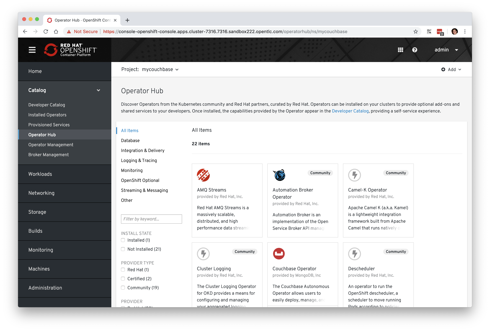

	> **NOTE**: Only users with cluster admin privileges can see the Operator
Hub interface.

3. At the top of the page, in the **Project** selector, choose `mycouchbase`.

4. Search, or browse to the Couchbase Operator and select it by clicking on it.

5. The description lays out the notable features of the
Operator. Go ahead and click "Install" to deploy the Operator on to the
cluster. It may take several moments after clicking "Install" before the
Subscription page shows up:

	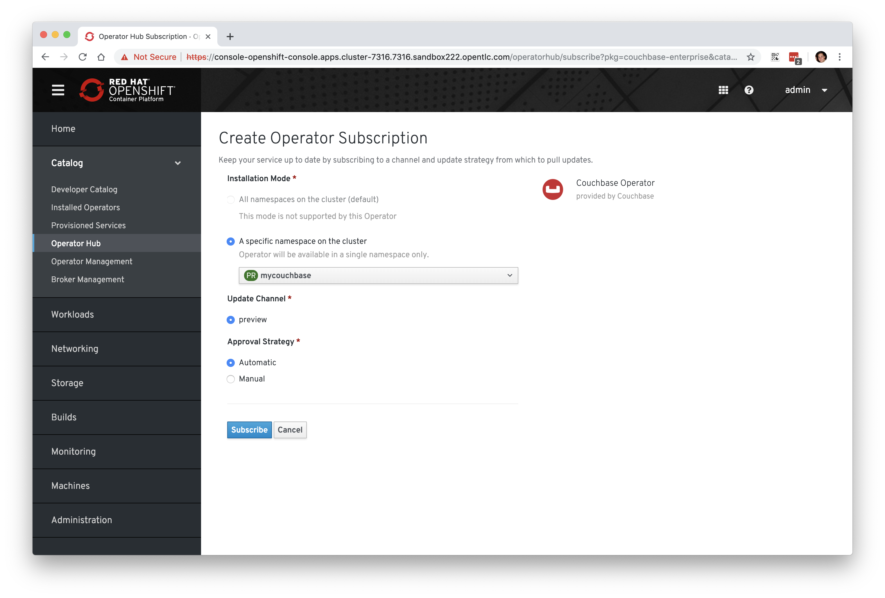

The installation process involves "**subscribing**" to an Operator from the hub.
This subscription mechanism is how OpenShift learns about updates to the
operator. Operator creators may roll updates for their operators to handle
things like updates, enhancements, bug fixes, and other changes to the
solution that the operator deploys. There are a number of options that you need
to be aware of when deploying an Operator:

### Installation Mode

Operators can be enabled for all Projects across the cluster or only within
specific namespaces. Not all Operators support each of these installation
methods. The Couchbase operator only supports installation for a specific
namespace. Make sure `mycouchbase` is selected to match the project you
created earlier.

### Update Channel

Each Operator publisher can create channels for their software, to give
administrators more control over the versions that are installed. In this
case, Couchbase only has a "preview" channel.

### Update Approval Strategy

If Operator creators enable their operators to update the deployed solutions,
Operator Lifecycle Manager is able to automatically apply those updates.
Cluster administrators can decide whether or not OLM should or should not
automatically apply updates. In the future, when Couchbase releases an
updated operator to the "preview" channel, you can decide whether you want to
approve each update, or have it happen automatically. Choose "Automatic" for
now.

After clicking "Subscribe", the Couchbase entry will now show that it is
"Installed":

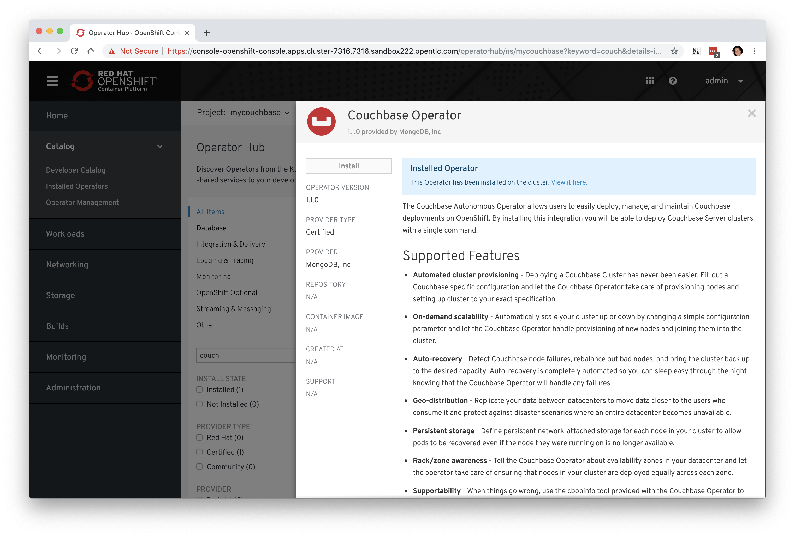

It's important to note that while the Operator Hub page indicates that the
operator is "installed", really it is indicating that the operator is configured
to be installed. It may take several minutes for OpenShift to pull in the
operator to the cluster. You can check on the status of this operator with the
following command:

~~~bash
$ oc get pod --all-namespaces | grep -i couch
mycouchbase               couchbase-operator-7b4885487c-9wz5t                    1/1       Running     0          8m28s
openshift-marketplace     installed-certified-mycouchbase-654bb64bc5-w8b9g       1/1       Running     0          9m16s
~~~

You will likely see the Couchbase operator pod in `ContainerCreating` status
if you look very soon after finishing the installation/subscription process.

## Using Secrets
The Couchbase operator is capable of installing and managing a Couchbase
cluster for you. But, before it can do that, it has a [prerequisite for a
Kubernetes
secret](https://docs.couchbase.com/operator/1.1/couchbase-cluster-config.html#authsecret)
that it can use to configure the username and password for the cluster. You
have a couple of ways to create this secret.

Firstly can you can do it via the Web Console:

1. Open the OpenShift web console and navigate to "**Workloads**" on the
left-hand side menu and then select "**Secrets"**.

2. Make sure the Project selector is set to `mycouchbase` at the top.

3. Now click the "**Create**" selector and choose "Key/Value Secret":

	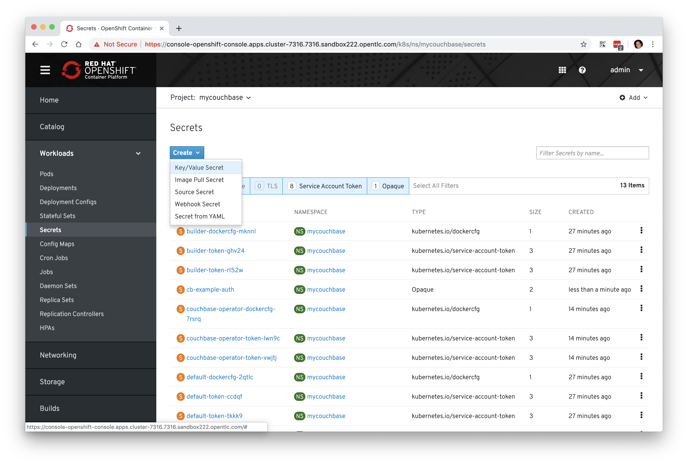

4. Click "**+ Add**" at the upper right-hand area of the panel, and then
choose "**Import YAML**". Paste the following YAML into the form (the username
is "couchbase" and the password is "securepassword"):

    ```YAML
    apiVersion: v1
    data:
      password: c2VjdXJlcGFzc3dvcmQ=
      username: Y291Y2hiYXNl
    kind: Secret
    metadata:
      name: cb-example-auth
      namespace: mycouchbase
    type: Opaque
    ```

5. Once you're done, finally click create:

	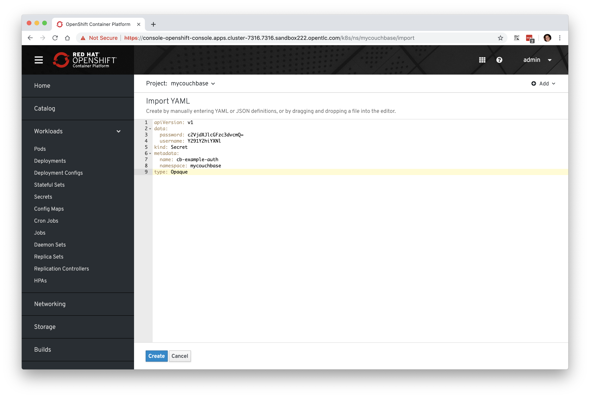

**Alternatively**, you can create the secret directly using the following
command:

~~~bash
$ oc create -f https://raw.githubusercontent.com/openshift/training/master/assets/cb-example-auth.yaml
~~~

Ultimately, you want a secret with the username `couchbase` and the password
`securepassword` (both examples above use that).

## Using an Installed Operator

Regular users will use the "**Developer Catalog**" menu to add shared apps,
services, or source-to-image builders to projects. Let's explore that interface
and deploy a Couchbase cluster from our newly created Operator:

1. Navigate to the "**Developer Catalog**" from the "**Catalog**" section of the
main menu on the left-hand side.

	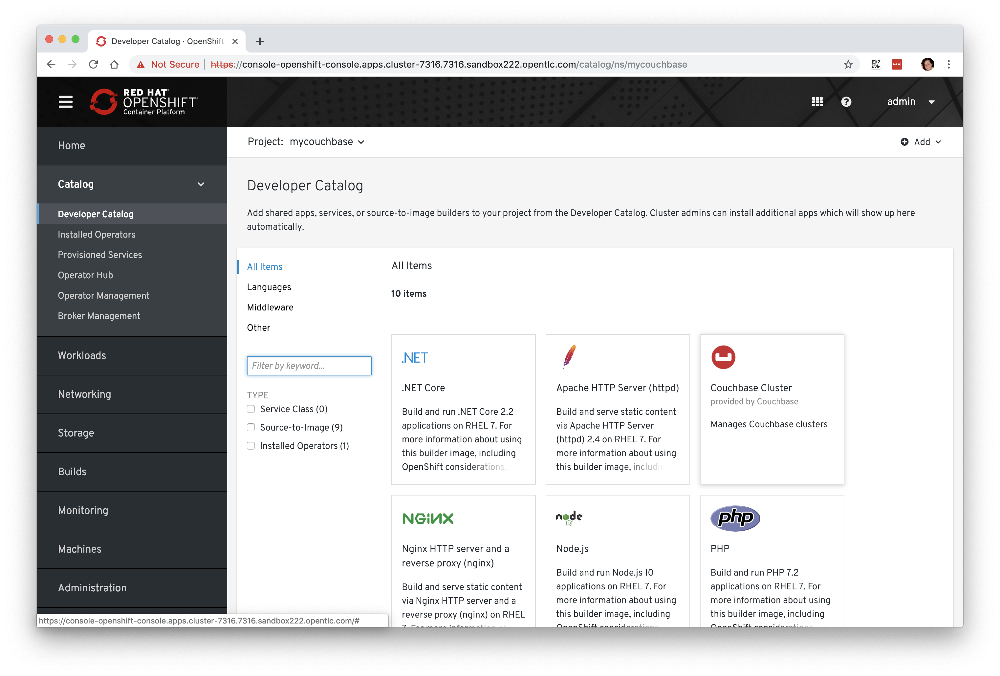

2. At the top of the page, again make sure you select `mycouchbase` from the
Project dropdown.

3. You should see that the Couchbase operator is available. If you choose a
different Project, you should also notice that the Couchbase operator is **not**
available in other Projects.

4. Click on the Couchbase Cluster tile, which is a capability that the Operator
has extended our OpenShift cluster to support. Operators can expose more than
one capability. For example, the MongoDB Operator exposes three common
configurations of its database (and you would see three _different_ MongoDB
tiles).

5. Deploy an instance of Couchbase by clicking the "**Create**" button in the
top left:

	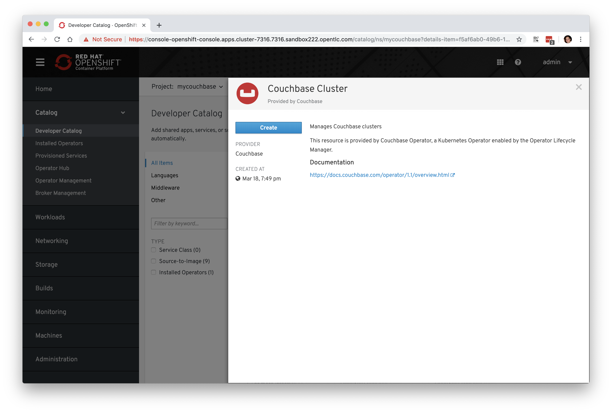

6. The YAML editor has been pre-filled with a set of defaults for the
resulting Couchbase cluster. One of those defaults is a reference to the
Secret you created earlier:

	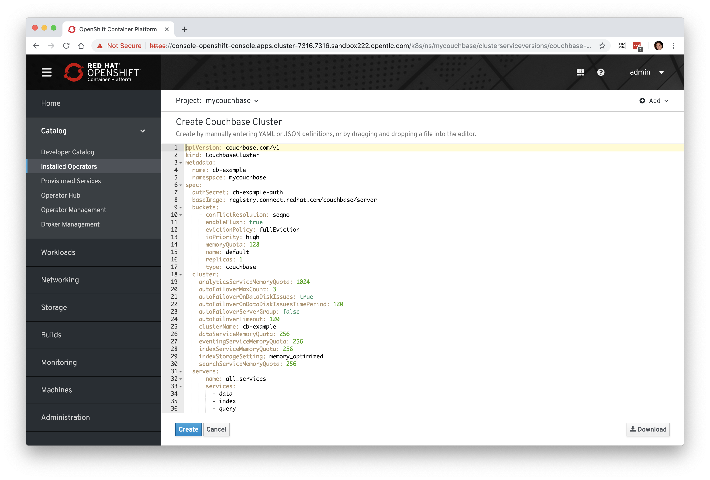

7. At this point we're able to change some of the Couchbase deployment
parameters to our liking. Set the `replicas` field (under `.spec.buckets`) to
`3`, so our Operator sets up a highly available cluster for us. Your YAML should
look like the following:

	```YAML
	apiVersion: couchbase.com/v1
	kind: CouchbaseCluster
	metadata:
	  name: cb-example
	  namespace: default
	spec:
	  authSecret: cb-example-auth
	  baseImage: registry.connect.redhat.com/couchbase/server
	  buckets:
	    - conflictResolution: seqno
	      enableFlush: true
	      evictionPolicy: fullEviction
	      ioPriority: high
	      memoryQuota: 128
	      name: default
	      replicas: 3
	      type: couchbase
	cluster:
    analyticsServiceMemoryQuota: 1024
    autoFailoverMaxCount: 3
    autoFailoverOnDataDiskIssues: true
    autoFailoverOnDataDiskIssuesTimePeriod: 120
    autoFailoverServerGroup: false
    autoFailoverTimeout: 120
    clusterName: cb-example
    dataServiceMemoryQuota: 256
    eventingServiceMemoryQuota: 256
    indexServiceMemoryQuota: 256
    indexStorageSetting: memory_optimized
    searchServiceMemoryQuota: 256
  servers:
    - name: all_services
      services:
        - data
        - index
        - query
        - search
        - eventing
        - analytics
      size: 3
  version: 5.5.3-3
  ```

	The operator provides many sensible defaults. Take note of the `servers`
stanza and its `size` element. This represents the number of distinct
Couchbase Pods that will be created and managed by the operator. We'll
explore changing that in a moment.

8. Click "Create". Afterwards, you will be taken to a list of all Couchbase
instances running with this Project and should see the one you just created
has a status of "**Creating**":

	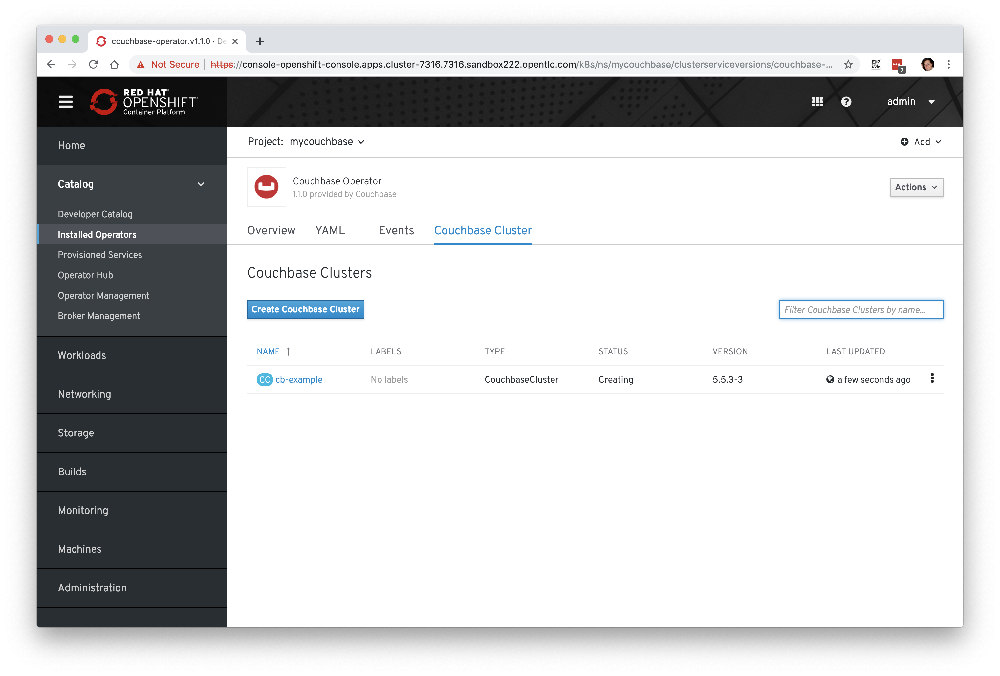

### View the Deployed Resources

Navigate to the Couchbase Cluster that was deployed by clicking `cb-example`,
and then click on the "**Resources**" tab. This collects all of the objects
deployed and managed by the Operator. From here you can ultimately view Pod
logs to check on the Couchbase Cluster instances.

If for some reason you had navigated away from the page after creating your
Couchbase cluster, you can get back here by clicking "**Catalog**" ->
"**Installed Operators**" -> "**Couchbase Cluster**" -> `cb-example`.

We are going to use the Service `cb-example` to access the Couchbase
dashboard via a Route:

~~~bash
$ oc expose service cb-example -n mycouchbase
route.route.openshift.io/cb-example exposed
~~~

You should now have a route:

~~~bash
$ oc get route -n mycouchbase
NAME         HOST/PORT                                                              PATH      SERVICES     PORT        TERMINATION   WILDCARD
cb-example   cb-example-mycouchbase.apps.cluster-7316.7316.sandbox222.opentlc.com             cb-example   couchbase                 None
~~~

Your Couchbase installation is now exposed directly to the internet and is
not using HTTPS. Go ahead and copy/paste the URL into your browser. Login
with the user `couchbase` and the password `securepassword` (these were in
your secret). If you used different credentials, make sure you put in the
right ones:

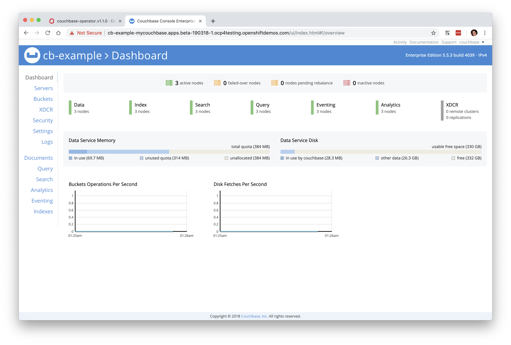

In the above, you should see 3 nodes listed for each function. We'll dynamically
modify this in the next section.

### Re-Configure the Cluster with the Operator

Keep the Couchbase dashboard up, but select the **Servers** link on the
left-hand side, it should look like the following:

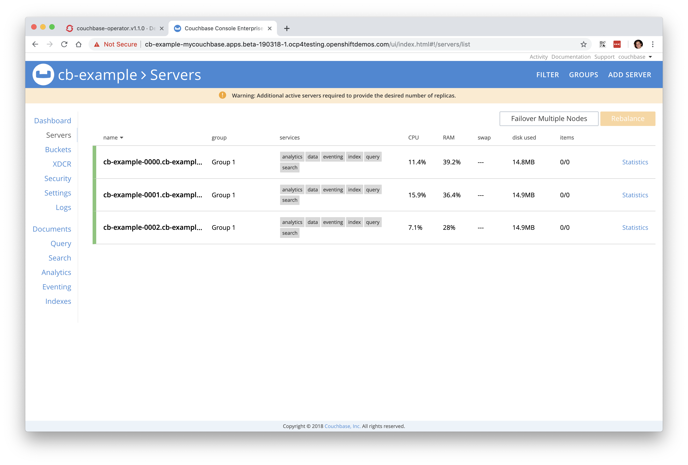

As the Operator scales up more Pods, they will automatically join and appear in
the dashboard. Next, edit your `cb-example` Couchbase instance to have a server
size of `4` instead of `3`. You can navigate back to the installed instances of
Couchbase via the web console, or you can use:

~~~bash
$ oc edit couchbaseclusters.couchbase.com/cb-example -n mycouchbase
(Opens in vi)
~~~

Ensure that your `.spec.servers` section of the yaml looks like the following-

```YAML
  servers:
  - name: all_services
    services:
    - data
    - index
    - query
    - search
    - eventing
    - analytics
    size: 4
```

When you've updated your yaml, save and exit your editor:

~~~bash
couchbasecluster.couchbase.com/cb-example edited
~~~

A few things will happen:

* The Operator will detect the difference between the desired state and the 
  current state
* A new Pod will be created and show up under "Resources"
* The Couchbase dashboard will show 4 instances once the Pod is created
* The Couchbase dashboard will show that the cluster is being rebalanced

Your cluster dashboard should dynamically update to show the progress:

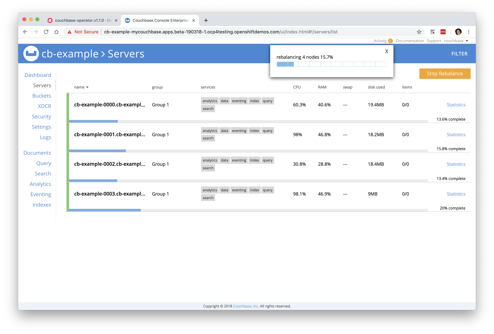

After the cluster is scaled up to `4`, try scaling back down to `3`:

~~~bash
$ oc edit couchbaseclusters.couchbase.com/cb-example -n mycouchbase
(Opens in vi)
~~~

If you watch the dashboard closely, you will see that Couchbase has
automatically triggered a re-balance of the data within the cluster to reflect
the new topology of the cluster. This is one of many advanced feautres embedded
within applications in OperatorHub to save you time when administering your
workloads.

### Delete the Couchbase Instance

After you are done, delete the `cb-example` Couchbase instance and the
Opeator will clean up all of the resources that were deployed. Remember to
delete the Route that we manually created as well. Remember to delete the
Operator instance and not to delete the Pods or other resources directly --
the operator will immediately try to fix that thinking that there's a
problem!

1. Navigate to "**Catalog**" --> "**Installed Operators**" on the left-hand
side

2. Select the "**Couchbase Cluster**" link under `Provided APIs` towards the
right of the panel

3. On the right of the `cb-example` cluster line, click on the drop down (3
dots) and select "**Delete Couchbase Cluster**":

	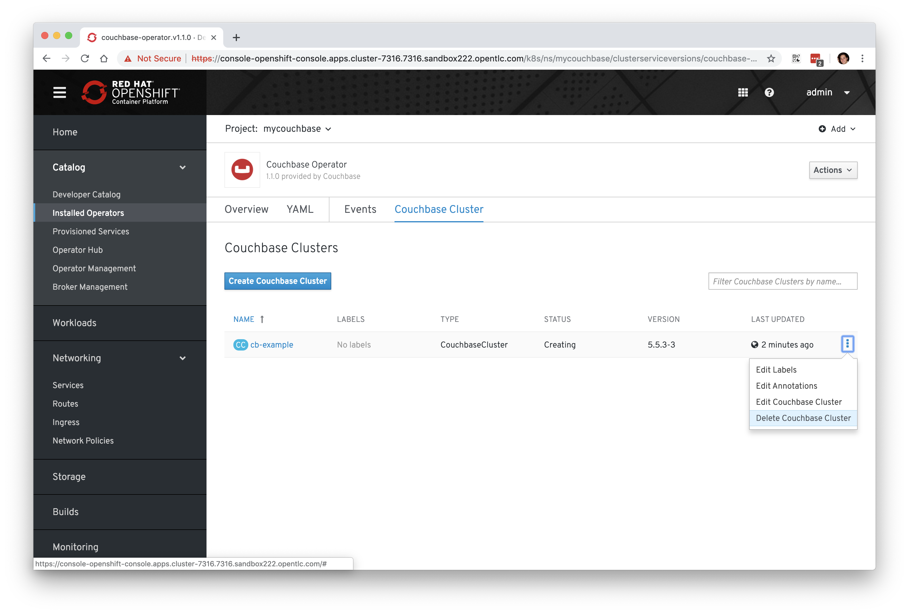

4. Return to the main menu on the left hand side, navigate to "**Networking**"
and then to "**Routes**"

5. On the drop-down menu (3 dots) to the right of our "**cb-example**" route,
select "**Delete Route**":

	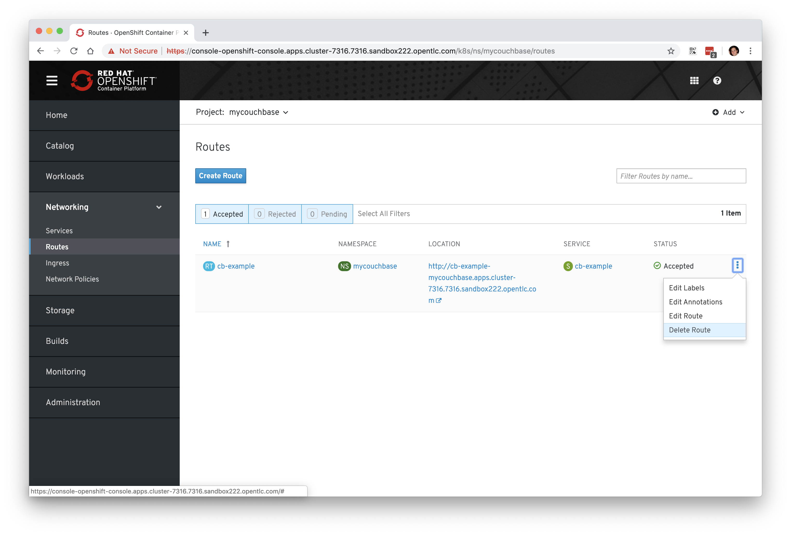

After you delete the `cb-example` cluster, if you look at the pods
quickly you'll see the pods terminating, otherwise you'll likely only see the
Operator pod running:

~~~bash
$ oc get pod -n mycouchbase
NAME                                 READY     STATUS    RESTARTS   AGE
couchbase-operator-678994b98-sqnt2   1/1       Running   0          39m
~~~

The Operator Pod remains, that's because there's still a Subscription for the
Couchbase operator in this Project. You can delete the Subscription (and, thus,
the Pod) by going to "**Operator Management**" -> "**Operator Subscriptions**".
There you can click the 3 dots and remove the Subscription for the Couchbase
Operator in the `mycouchbase` Project. Now there should be no pods, and you can
also delete the project if you wish.

## Try Out More Operators

Operators are a powerful way for cluster administrators to extend the cluster,
so that developers can build their apps and services in a self-service way. With
the expertise baked into an Operator, running high quality, production
instructure has never been easier.

OperatorHub will be continually updated with more great Operators from Red Hat,
certified partners and the Kubernetes community.

# End of Materials
Congratulations. You have reached the end of the materials. Feel free to
explore your cluster further.

If you are done, you can proceed to [cleanup your cluster](98-cleanup.md) You
can also take a look at the [tips and tricks](97-tips-and-tricks.md) section.
